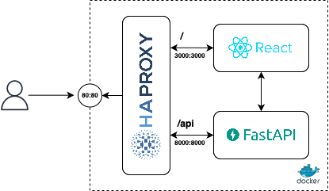

# 🧪 Challenge: Load Balancing with HAProxy + Docker + React + FastAPI + JMeter

This project is a hands-on challenge designed to help you explore containerization, load balancing, and performance testing using real-world tools.


Figure 1. Target Architecture

---

## 🎯 Objectives

You will:

1. Containerize a frontend and backend application.
2. Set up HAProxy to load balance between multiple backend instances.
3. Connect all services using Docker Compose.
4. Run the full app stack locally.
5. Design and execute load tests using Apache JMeter.

---

## 🧱 Project Structure

You are expected to create the following directory structure:

```
.
├── backend/
│   │   main.py
│   └── Dockerfile
├── frontend/
│   ├── src/
│   │   └── App.jsx
│   │   └── main.jsx
│   ├── index.html
│   └── Dockerfile
│   └── package.json
│   └── vite.config.js
├── haproxy/
│   └── haproxy.cfg
├── docker-compose.yml
└── README.md
```

You must create all missing files from scratch as part of the challenge. (dockerfile and docker-compose)

---

## 🔧 Tasks

### 1. Generate Dockerfiles

- Create a `Dockerfile` for the **backend** using Python and FastAPI.
- Create a `Dockerfile` for the **frontend** using React and Vite.
- Ensure each image exposes the correct ports and builds successfully.

---

### 2. Complete the Docker Compose Setup

- Define services for:
  - Two (or more) backend containers
  - One HAProxy container
  - One frontend container
- Configure dependencies and port mappings
- Map a custom HAProxy config file to the HAProxy container

---

### 3. Run the App Locally

- Use `docker compose up --build`
- Access the frontend through the exposed port
- Verify that the frontend communicates with the backend through HAProxy

---

### 4. Run Load Tests Using JMeter

- Design a test plan in Apache JMeter to simulate concurrent users making HTTP requests to the backend via HAProxy.
- Use different listeners such as:
  - View Results Tree
  - Summary Report
  - Response Time Graph
- Experiment with different numbers of users and request patterns.

---

## 🧠 Hints

- Use a `balance` strategy in HAProxy like `roundrobin` or `leastconn`
- Make sure all services are reachable from within the Docker network
- Keep logs and metrics to understand how HAProxy is routing traffic

---

## ✅ Deliverables

- Your completed repository with:
  - All configuration and Docker files
  - A working application stack
  - Screenshots or reports from JMeter test results

---
